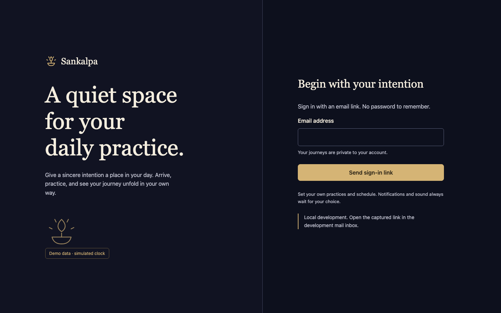
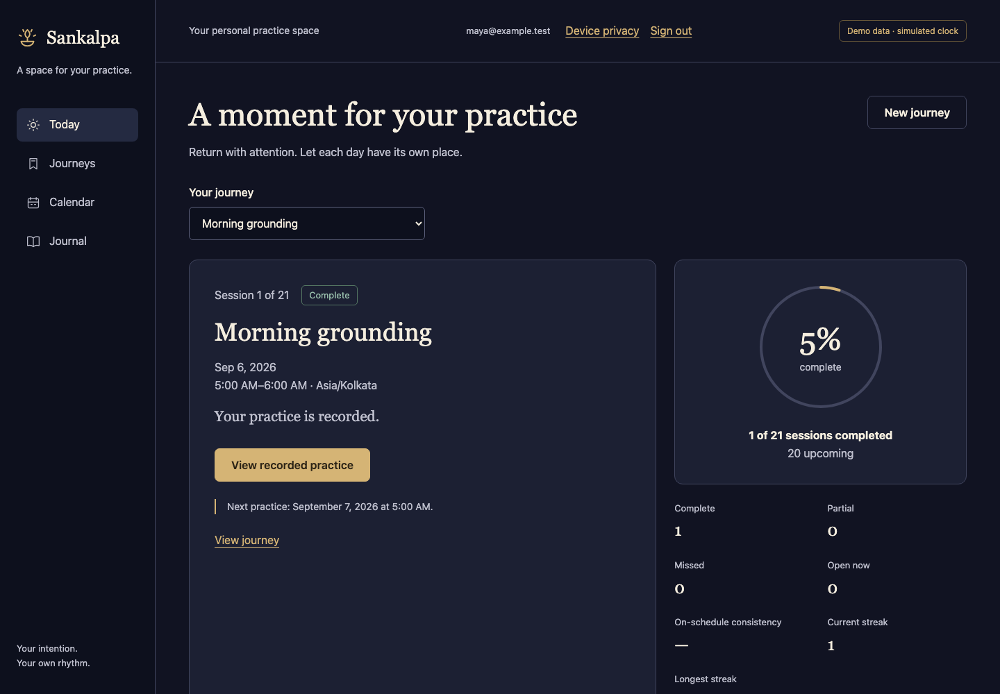
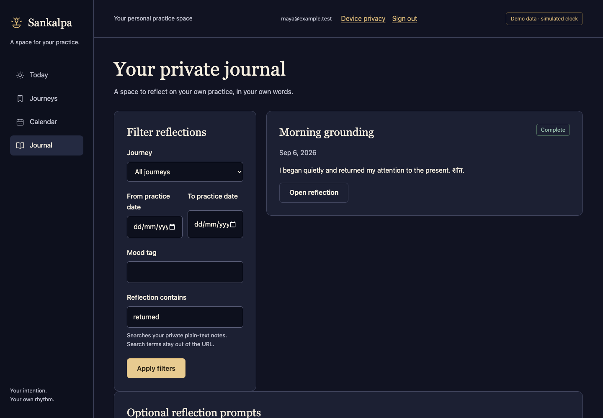

<p align="center"><strong>YOUR INTENTION · YOUR PRACTICE · YOUR OWN RHYTHM</strong></p>

# Sankalpa

**Give a sincere intention a place in every day.**

**Sankalpa is a personal spiritual commitment companion** for turning a sincere intention into consistent daily practice. Define what matters to you, return to it each day, and see your journey honestly—from the sessions you complete to the days you find difficult.

Stotra pathana, puja, mantra japa, meditation, or something entirely your own: your tradition and your choices lead the experience.

**[Run locally](#run-locally-on-macos)** · **[Give a five-minute demo](docs/DEMO.md#the-five-minute-walkthrough)** · **[See what works](#what-you-can-try-today)** · **[Explore the architecture](docs/PROJECT_PLAN.md)**



<p align="center"><em>A real local app screenshot. Sample data and a simulated practice clock; no external email or notification delivery.</em></p>

## A small daily practice, a visible journey

| Make it personal                                    | Follow through                                       | Keep the meaning                                                    |
| --------------------------------------------------- | ---------------------------------------------------- | ------------------------------------------------------------------- |
| Choose your intention, practices and daily targets. | Work through a checklist and confirm your session.   | Add private reflections in your own words.                          |
| Set your dates, weekdays, local time and timezone.  | See complete, partial, missed and upcoming sessions. | Revisit your journal and preserve an honest history of corrections. |

The aim is simple: help someone who makes a commitment with devotion keep returning to it with attention. There is no prescribed practice, compulsory streak or one-size-fits-all schedule.

## What you can try today

**The accepted `main` branch runs locally with real authentication and PostgreSQL persistence.** This is an implementation in progress, with a working demonstration—not a production launch.

| Working local workflows                                          | Still being developed or validated                                                    |
| ---------------------------------------------------------------- | ------------------------------------------------------------------------------------- |
| Email-link sign-in through a captured local inbox                | Scheduled reminders, device registration and real phone push                          |
| Personalized journeys, checkboxes and repetition/minute targets  | PDF downloads, themes and ambient audio                                               |
| Today, journey progress, calendar and session lists              | Full archive/deletion controls and deployment recovery                                |
| Completion, late records, corrections and private journal search | Hosted deployment, physical-device testing and remaining accessibility review         |
| Offline drafts, replay and explicit conflict review              | **Known offline navigation defect:** some query-bearing links fail while disconnected |

Use the **online walkthrough** below for presentations; the guide also documents the current calendar-filter requirement to provide an explicit date. The [independent review](docs/handoffs/SK-008-independent-review.md) and [current checkpoint](docs/PROJECT_PROGRESS.md) retain the offline defect and unfinished work. Planned reminders are supportive prompts, never guaranteed wake-up alarms.

## Run locally on macOS

### One-time prerequisites

Install Git, [fnm](https://github.com/Schniz/fnm#installation), and [Docker Desktop for Mac](https://docs.docker.com/desktop/setup/install/mac-install/). Complete Docker Desktop's first-run setup. No hosted Supabase account or paid service is needed for the local demo.

### One command prepares and starts the demo

If you already have the repository, run this from its folder:

```sh
./setup.sh
```

For a fresh checkout:

```sh
git clone --branch main https://github.com/rajeshkanaka/Sankalp.git Sankalpa
cd Sankalpa
./setup.sh
```

The script selects the pinned Node/npm versions, installs dependencies, opens Docker Desktop if needed, allocates unused local ports, **starts PostgreSQL and authentication, applies database migrations**, generates the private local configuration, loads sample journeys for a new demo, builds the app, and opens the app and email inbox. Wait for **Ready to present** and keep the terminal open.

**Already set up?** The same command preserves your journeys, reflections and demo clock. If an app or test server is already running, it prints the existing addresses and stops before changing anything. Open that demo, or stop its original terminal before rebuilding. On the maintainer's current Mac, the app is at **[localhost:3001](http://localhost:3001/welcome)**; fresh machines normally use **[localhost:3000](http://localhost:3000/welcome)**. Always use the addresses printed for your checkout.

The first setup downloads packages and container images, so run it **before the meeting**. `./setup.sh --no-open` prints the links without opening browser tabs. [What the script runs, recovery and manual commands](docs/DEMO.md#setup-and-recovery).

### Sign in and show the workflow

1. Enter **`maya@example.test`** and select **Send sign-in link**.
2. Open the newest message in the local mail inbox and follow its sign-in link **in the same browser profile**.
3. On **Today**, select **Morning grounding** under **Your journey** and open the practice.
4. Check **Sit quietly** and **Set an intention**, wait for the saves, then select **Complete this session**.
5. Return with **Done**. The fresh morning journey shows **1 of 21 sessions completed · 20 upcoming · 5% complete**. Reload to demonstrate persistence.

**This is real authentication.** Supabase validates the sign-in link and session; PostgreSQL stores the account's practice data. Only email delivery is captured in the local inbox, so no test message goes to Gmail or another external account. Real inbox delivery needs the planned SMTP/provider setup.

**[Give the five-minute demo →](docs/DEMO.md#the-five-minute-walkthrough)** for reflections, journal search, historical accountability and the optional 33% progress example.

Press **Ctrl-C** to stop the script's app. The database keeps its data; `fnm exec --using 24.20.0 npm run db:stop` also stops the local backend. Repeatable fixture reset is explicit: `./setup.sh --reset-demo` replaces the marked sample accounts' practice data—read the [reset instructions](docs/DEMO.md#repeat-the-same-presentation) first. These `localhost` links work on the host Mac; use screen sharing to present remotely.

## A closer look

<table>
  <tr>
    <td width="50%"><strong>Progress you can see</strong><br></td>
    <td width="50%"><strong>A journal in your own words</strong><br></td>
  </tr>
</table>

These are real screenshots from the M3 presenter walkthrough, using synthetic accounts and a local database. [Screenshot provenance](docs/images/README.md) · [Setup and walkthrough evidence](docs/evidence/demo-launcher/manifest.md)

## Built for careful implementation

**Next.js · React · TypeScript · PostgreSQL · Supabase Auth** form the application. Vitest covers domain and database behavior; Playwright exercises the actual app in Chromium, WebKit and Firefox. GitHub Actions runs the repository's verification workflow. Exact dependency pins and architectural decisions live in [DECISIONS](docs/DECISIONS.md).

For manual development commands, first select Node 24.20.0 in your shell as shown in the [manual setup guide](docs/DEMO.md#setup-and-recovery). Then `npm run dev:demo -- --profile M3` starts the development server with the same seeded clock. For automated verification, install the test browsers once, then run:

```sh
npm exec -- playwright install chromium webkit firefox
npm run verify
npm run test:ui
```

Run checks before or after a presentation, not during it. The tests use their own synthetic namespaces and test port. CI results and retained evidence describe the checks performed; they do not imply every planned feature is complete.

| Looking for…                                          | Start here                                                                                                 |
| ----------------------------------------------------- | ---------------------------------------------------------------------------------------------------------- |
| A reliable local presentation                         | [Demo and presenter guide](docs/DEMO.md)                                                                   |
| Product behavior and acceptance criteria              | [Application specification](docs/APP_SPECIFICATION.md)                                                     |
| Architecture, milestones and verification             | [Project plan](docs/PROJECT_PLAN.md)                                                                       |
| Current work, paused checkpoints and branches         | [Progress](docs/PROJECT_PROGRESS.md) · [Branch map](docs/BRANCHES.md) · [Session log](docs/SESSION_LOG.md) |
| Task ownership and completion status                  | [Authoritative task register](docs/TASKS.md)                                                               |
| Contributing with Codex, Claude Code or another agent | [Shared instructions](AGENTS.md) · [Claude adapter](CLAUDE.md)                                             |

## About and feedback

Created by **[Rajesh Pandhare](https://github.com/rajeshkanaka)**, under **AI'Gurukul**. For a reproducible bug or project feedback, [open an issue](https://github.com/rajeshkanaka/Sankalp/issues). Include the branch, setup step and observed behavior; leave out credentials and personal reflections.

This repository is available for review, education and portfolio evaluation under its **[custom license](LICENSE)**. Review those terms before reuse or distribution.
