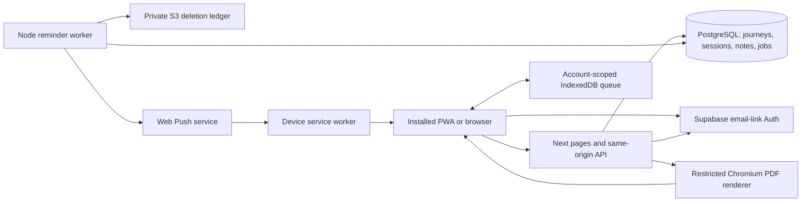

# Sankalpa implementation plan

Prepared 2026-09-05–06 (Asia/Kolkata). This approved plan covers both implemented and remaining scope; it is not a completion claim. Approval/checkpoint authority: [PROJECT_PROGRESS](PROJECT_PROGRESS.md) on main. Execution/status authority: [TASKS](TASKS.md). Product acceptance authority: [APP_SPECIFICATION](APP_SPECIFICATION.md). Stack pins, rationale, clarifications and dated official sources: [DECISIONS](DECISIONS.md). Active and historical worktrees: [BRANCHES](BRANCHES.md).

## 1. Outcome, scope and constraints

Build a private, calm spiritual-practice companion for an individual adult practitioner. The user chooses an intention and practices, schedules a fixed journey, prepares using configurable prompts, records practice honestly, examines progress and preserves private reflections. Multiple accounts own isolated data; multiple active journeys are supported. Coding agents are a development method, not an application feature.

The complete launch scope is the existing specification §2–9, with D04's explicit clarifications submitted for approval. It includes custom checkbox/repetition/minute targets, daily/weekday recurrence, two duration modes, civil/explicit overnight attribution, future schedule revisions, complete/partial/missed/late history, countdown/dashboard/calendar/list, private journal, offline check-ins/conflicts, PWA installation, Web Push/history/quiet hours/snooze, PDF, three themes, original ambient audio, archive/deletion and account privacy controls.

Non-goals: native mobile app, guaranteed alarm/wake-up delivery, multiple time slots inside one journey, social feeds/rankings, religious advice, AI interpretation, payments, public sharing, automatic restarts/extensions, chant libraries/counters, audio uploads, calendar integration and translated UI. Do not drop existing launch features merely because they appear in a later milestone.

Primary workflows:

1. Email-link sign-in → blank custom setup or explicitly chosen editable template → schedule/reminder preview → activate → Today.
2. Open session → save individual values → deliberately confirm only when all targets are met → optional reflection → reload and see the same progress.
3. Browse calendar/list/history → distinguish partial/missed/late/recorded-later → correct with actual performed time → recomputed totals without erasing chronology.
4. Preview a future schedule revision → preserve opened/history records → replace only future unopened sessions and reminder jobs.
5. Enable notifications explicitly → register this device → test authorized delivery → follow a precise session link; history distinguishes service acceptance and opening.
6. Work offline with a visible pending state → reconnect/reopen → sync once or resolve conflicts without silently losing a draft.
7. Filter reflections/export an authorized PDF → optionally archive, delete a journey, or delete the account with clear consequences.

Measurable acceptance: retain every A01–A27 in the specification and the task mapping in TASKS §4. Two checkbox practices require at most three taps once the session is open; 7/21 displays 33% everywhere; incomplete checklists add no completion credit; cross-account access and direct browser database access fail. At 320 CSS px, all primary workflows remain usable, keyboard-operable and status-readable without color/sound. Operational targets to **measure**: Today usable ≤2.5s on the recorded representative phone/network profile; local save feedback ≤200ms; 21-session PDF ≤10s on the release reference environment; ≥95% normal dispatch attempts begin within 60s. These are not measured results yet.

## 2. Architecture and module contracts

One npm project, one Next app and a separate Node worker entry point share pure domain modules. PostgreSQL is the single canonical record; no derived dashboard database or separate queue. The selected platform is D01/D07, exact pins D02. SQL migrations are coordinator-owned; `pg` keeps multi-record operations in explicit transactions. Supabase provides local/managed Auth and PostgreSQL. D03 defines the restricted database roles and request authentication.



### 2.1 Planned source boundaries

These boundaries were selected at planning approval. The foundation now exists; §5.1 records verified command/module availability. Later feature paths remain planned until their task creates them. Inspect the repository before claiming a path or capability exists.

| Path/module | Responsibility and allowed dependencies |
|---|---|
| `src/app/` | App Router pages, layouts, loading/errors and thin `api/**/route.ts` handlers. Import feature UI and server services, not ad hoc SQL. |
| `src/components/`, `src/styles/` | Accessible shared controls/navigation and sanctuary theme tokens; no business persistence. |
| `src/domain/` | `contracts.ts`, `validation.ts`, `schedule.ts`, `status.ts`, `metrics.ts`, `reminders.ts`; pure typed functions; no React, network, database or globals for time. |
| `src/server/auth/`, `src/server/db/` | Request-scoped auth, restricted pg pool/transaction context, error mapping, migrations' generated database types. Server-only imports. |
| `src/server/journeys/`, `sessions/`, `journal/` | Transactional application services consuming domain contracts. Own consistent reads/revisions and operation-level idempotency. |
| `src/features/journeys/`, `practice/`, `progress/`, `journal/` | Corresponding forms/views. Each has independent tests and no access to server secrets. |
| `src/features/reminders/`, `src/server/reminders/`, `src/worker/` | Device/permission UI; safe payload and database job interfaces; worker claim/send/settle loop. No reflection access in worker. |
| `src/offline/`, `src/service-worker/` | Account-scoped IndexedDB queue/draft/cache; service-worker source. Generated `public/sw.js` is never hand edited. |
| `src/server/exports/`, `src/features/exports/` | Authorized snapshot, escaped print template, bounded Chromium renderer and download UI. |
| `src/features/settings/`, `src/server/privacy/` | User appearance/audio/preferences and logout/archive/delete flows. |
| `public/fonts/`, `public/audio/`, `docs/ASSETS.md` | Versioned local assets and rights/hash records; no remote tracking asset URLs. |
| `supabase/config.toml`, `supabase/migrations/` | Canonical local DB/auth config and ordered SQL migrations, roles, indexes and grants. Only coordinator writes. |
| `scripts/`, `tests/fixtures/`, `tests/unit/`, `tests/integration/`, `tests/ui/` | Reproducible local/demo/CI commands, synthetic data, Vitest and Playwright tests. |
| `Dockerfile`, `render.yaml`, `.github/workflows/ci.yml` | Build/deployment description and CI, created only by owning tasks. No automatic external deployment. |

### 2.2 Shared contract checkpoint

SK-001 established the initial contracts in `src/domain/contracts.ts`; subsequent additions are coordinator-serialized. The following describes the selected boundaries. Push/offline/export interfaces remain planned until their owning tasks implement them:

- Server `getRuntimeInfo()` supplies the clock value; pure domain calls receive `now` explicitly. `IsoInstant` is an ISO UTC string, `PracticeDate` an ISO calendar date, `LocalTime` HH:mm, `Id` a UUID, `Revision` a nonnegative integer. Normal mode uses server time; test mode uses D05's guarded fixture clock.
- `JourneyDraft`: `title`, `intention`, ordered `practices`, `schedule`, `reminders`. `PracticeDefinition` discriminates `checkbox` (no numeric target), `repetitions` or `minutes` (positive integer `target`). `ScheduleInput`: `startDate`, `durationMode: calendar_days | occurrences`, `durationValue`, ISO `weekdays` 1–7, `localTime`, IANA `timeZone`, `attribution: civil | previous_evening`, `windowMinutes`.
- `previewSchedule(input, now): SchedulePreview` returns practice dates, ordinals, UTC opens/closes, adjustment warnings and total count; session IDs are allocated only at activation. `createJourney` returns `JourneyDraftPreview`, adding the validated-input fingerprint and proposed reminder times with `isPast`. Those times are disabled suggestions until reminder implementation. `generateSchedule(input, retainedSessions, now): PlannedOccurrence[]` is server authoritative. Activation regenerates the schedule rather than trusting client rows.
- `SessionRecord`: immutable `id`, `journeyId`, `scheduleVersionId`, `practiceDate`, resolved `opensAt/closesAt`, original practice definitions; mutable values, `confirmed`, `performedAt`, `recordedAt`, `revision`, `supersededAt`. Recomputed future ordinals must not renumber historical rows.
- `deriveStatus(session, now): upcoming | open | partial | complete | missed` follows D04 and specification §5; completion has independent `on_schedule | practiced_late` and `recorded_later` labels. `computeMetrics(sessions, now): JourneyMetrics` returns exact counts, rounded percent, on-schedule ratio, current/longest streak and ended/fully-completed flags; excludes superseded rows.
- `MutationEnvelope<T>`: `operationId`, `baseRevision`, `payload: T`; authenticated owner comes from the session. `ApiError`: `code`, safe `message`, optional field errors, `correlationId`; conflicts include authorized current revision/value for deliberate recovery, never another account's content.
- `PushTransport.send(subscription, payload, tag): accepted | terminal_failure | transient_failure | uncertain`. Fake implementation returns an explicitly simulated receipt; real provider acceptance never means display. `claimJobs(now, limit)`, `revalidateJob(jobId, leaseToken, now)`, `settleJob(jobId, leaseToken, result)` are worker-only database interfaces.
- `ExportSnapshot`: immutable `asOf`, authorized journey/version/session/practice/reflection data, selected dates/fields, closing reflection and metrics computed from included canonical data. Overall journey metrics and selected-range metrics have separate explicit labels.

### 2.3 API and transaction integration

Preserve the specification §8 route contract; add only these required details. UI sends same-origin JSON and handles 401, 404, 409, 422, 429 and safe 5xx consistently. Reads support cursor/date filters and bounded page sizes (maximum 100 items).

| Boundary | Required atomic behavior |
|---|---|
| `POST /api/journeys`, `POST /api/journeys/:id/activate` | Save validated draft/return preview, then recompute server schedule on activation; check draft revision/fingerprint, insert versions/practices/sessions and reminder work in one transaction. |
| `PUT /api/sessions/:id/practices` | Save typed values belonging to that session/version using base revision; reject unrecognized/mixed-owner nested IDs. No completion credit until confirmation. |
| `POST` / `DELETE /api/sessions/:id/completion` | Lock session; authorize; validate targets, reported time and revision; write/undo one confirmation, amendment and cancellation atomically. Reject future performed times and pre-opening completion. |
| `PUT /api/sessions/:id/reflection` | Store one text/moods record with revision; return recoverable conflict. Autosave is debounced and explicit Save remains available. |
| `POST /api/journeys/:id/schedule-revisions` | `mode: preview | apply`; fingerprint + current revision on apply; retain opened/history rows; supersede only unopened future rows; insert new versions and cancel/regenerate applicable jobs in one transaction. |
| `PUT /api/journeys/:id/metadata` | Revisioned title/intention mutation only; preserve the original schedule and historical practice definitions (D14). |
| `PUT /api/journeys/:id/reminders` | New preference revision; cancel obsolete jobs, generate only eligible future jobs. Offset changes never replay past sends. |
| `POST` / `DELETE /api/push-subscriptions` | Bind validated device registration to authenticated account; removal targets its own subscription only. Registration generation invalidates obsolete jobs. |
| `POST /api/sessions/:id/snooze`, `POST /api/notifications/:id/opened` | Snooze replaces pending reminders in the next ten minutes and must precede close. Click report deduplicates an authorized event; reading history is a different event. |
| `POST /api/push-subscriptions/:id/test` | Explicit rate-limited test for this account/device; fake result labeled; real sending requires configured authorized environment. |
| `GET /api/notifications`, `POST /api/journal/query` | Owner-only paginated filters; journal text/mood/date/journey search; no public search index. |
| `POST /api/exports` | Validate range/fields, take one repeatable-read authorized snapshot, release transaction before bounded render, return private PDF attachment. |
| `POST /api/journeys/:id/archive`, `DELETE /api/journeys/:id`, `DELETE /api/account` | Explicit confirmation; account deletion requires fresh reauthentication; disable access/sends before durable cleanup and auth deletion. |

Idempotency table key `(owner_id, operation_id)` includes operation type, request hash and safe response reference; retries with a different body return 409. Retain keys for 30 days, bound offline replay age to 30 days, then require review/resubmission with the original draft preserved. Revision checks and session uniqueness remain permanent defenses. Lock the owning journey/session before schedule, completion and dispatch eligibility changes. SQL CHECK/FK constraints enforce parent relationships and allowed values; all application tables have RLS and explicit grants per D03. Worker leases use `FOR UPDATE SKIP LOCKED`, capped batches, a lease token, bounded timeout and recovery; never hold a DB transaction over external HTTP delivery.

## 3. Time, persistence and failure design

APP_SPECIFICATION §5 and D04 own schedule/status rules. Implement local-calendar recurrence, explicit practice date, persisted UTC bounds, custom gap/fold handling and immutable historical versions. A client clock cannot establish attendance or change record identity. Store performed time and recorded time separately. Read-time derivation makes closed/missed status correct even if the worker is down; worker inserts one idempotent closure event, never drives the UI's time truth.

Completion feedback can be immediate locally but must show pending/error until the server acknowledges. Offline operation stores base revision and operation ID; replay in order per session, pause the conflicted stream, preserve both versions and let the user resolve. Never auto-merge conflicting note text or silently overwrite a newer checkbox. Drafts/queue survive reload where browser storage is available; storage denial/quota failure is visible. Account switch cannot display another account's local cache. Use service-worker caching only for a public shell/static assets plus explicitly managed IndexedDB records; no blind cache-first private pages. Freeze an offline draft's original version; a superseded target session requires review rather than silent reassignment.

Worker poll interval is 30 seconds with a single active process initially. Claim ≤50 due jobs per batch and cap send concurrency at four. Lease lasts 60 seconds and send timeout is ten seconds; renew/recheck on long work, reject stale settle tokens. Retry at most three total attempts, within five minutes of intended time and strictly before the window closes. Expire outage backlog. Recheck completion, archive, deletion, quiet hours, preferences and subscription generation immediately before network dispatch. An unavoidable send/cancel race is recorded truthfully; stable notification tags reduce duplicate display but do not guarantee exactly-once delivery. No reflected private text in logs/payloads.

## 4. End-to-end milestones and visual review

Milestone membership is fixed below; task status lives only in TASKS. Every milestone preserves earlier smoke/regression workflows. **Internal task/substep checkpoints are recoverable work checkpoints, not a substitute for a completed runnable milestone demonstration.** Each milestone stops only after its included tasks meet their technical gates and the coordinator presents the real demo, commands, results and evidence, then waits for the user's review before the next milestone.

### Shared demo and evidence protocol

The milestone recipes below are extended by their feature owners; §5.1 distinguishes implemented commands/profiles from later **planned** capabilities. Use §5 setup then `npm run demo:seed -- --profile M1` (substitute milestone) and `npm run dev:demo -- --profile M1`. Seed/reset is permitted only against that worktree's disposable local database; scripts reject hosted URLs, unknown schemas and production mode. It destroys only the named synthetic fixture namespace, never a personal dataset. UI tests use their own reset namespace and run separately from the user's live demo.

Demo fixture accounts are `maya@example.test` and `arun@example.test`, authenticated through the local captured email-link flow. No shared real credentials. Fixed logical clock is part of each fixture; page shows “Demo data · simulated clock,” and M4+ also shows “Simulated reminder transport.” Fixture identities/namespaces are declared in `tests/fixtures/ids.ts`; Supabase-generated synthetic account UUIDs are resolved into ignored `.local/fixtures/` manifests after marker verification. Never copy a real account UUID. Use an explicit “New journey” action to demonstrate creation rather than relying solely on prefilled screenshots.

For each milestone retain `docs/evidence/M<n>/<run-id>/manifest.md` with integrated commit SHA, dirty-diff hash if any, commands/exit results, machine/browser versions, seed/clock/timezone, URLs, screenshot names and test report links. Store synthetic successful-workflow screenshots in that directory, plus failures where useful. Keep secret-bearing browser traces/auth state out of Git. The configured safe reporter does not generate raw Playwright HTML; older reports can contain auth callback URLs and remain private ignored artifacts. CI retains only the allowlisted aggregate/test summary and synthetic workflow screenshots/manifests for14 days; request steps, errors, attachments and browser state are excluded. Manifests and safe synthetic screenshots/task reports are versioned. Never capture auth links/tokens or real reflections. A screenshot must come from the launched application, never a design mock/image generator.

### M1 — Create and record a private daily practice

- **Visible outcome/tasks:** SK-001, SK-002. A running, authenticated app creates a custom daily civil-date journey, records two checkboxes and persists completion after reload. Real local database/auth; reminders, offline and exports visibly unavailable, never fake-completed.
- **Prerequisites/setup/entry:** plan approval; macOS/Docker/selected Node; §5 first-bootstrap then standard setup; seed/start profile `M1`; [local welcome](http://localhost:3000/welcome). Use the mail inbox address printed by `npm run db:status` to open the captured link; no external email sent.
- **Data/actions:** clock `2026-09-05T06:15:00+05:30`; sign in as Maya → New journey → title “Morning practice”, intention “Begin with attention”, required “Puja” and “Quiet reflection” checkbox practices → daily, start 2026-09-05, 21 occurrences, 06:00 Asia/Kolkata, 60-minute window, civil date, reminders off → preview → activate → Open practice → check each item → confirm → reload.
- **Expected/failures:** Today shows 1/21, 5%, 20 upcoming and next practice 6 September 06:00. One checkbox alone cannot confirm; empty names/zero duration show field errors; opening another account's session gives safe 404; invalid/expired sign-in link offers resend. No notification/audio permission on load.
- **Automated/evidence/stop:** `npm run verify` and `npm run test:ui -- --grep @M1`; real reload/database assertions, screenshot `create-preview.png` and `completed-today.png`, account-isolation evidence. Present running localhost demo on user's Mac and pause. If Docker/browser cannot run, affected tasks are BLOCKED and checks NOT RUN; do not present static HTML as the outcome.

### M2 — Personal schedules and a truthful calendar

- **Visible outcome/tasks:** SK-003–SK-005. Fully custom recurrence/duration/targets, overnight setup, future revisions, dashboard/calendar/list and consistency metrics.
- **Prerequisites/setup/entry:** M1 visual approval; §5 standard setup; seed/start `M2`; `/journeys` and `/calendar` at the local base URL.
- **Data/actions:** clock `2026-09-12T04:01:00+05:30`; seed optional 21-night journey starting 5 September, first seven in-window completions; see 7/21, 33%, 14 upcoming, next practice 13 September 00:00. Create 12 Monday/Thursday meditation occurrences at 18:30 with a 20-minute target, starting 7 September (last occurrence 15 October). Create 30 calendar days starting 5 September, Tuesdays only (8/15/22/29 September; four sessions). Preview a custom civil 06:00 prayer. Revise overnight journey from practice date 12 September to 00:30 and rename a practice; inspect earlier seven entries.
- **Expected/failures:** counts and actual dates agree on setup/Today/calendar/list; historical labels/times remain unchanged. Preview `America/New_York` 8 March 2026 02:30 → first valid 03:00; 1 November 2026 01:30 chooses first occurrence. Reject overlapping/invalid windows, zero-occurrence span and any removal of opened sessions; other journey overlap shows warning only. Custom journey inserts no example stotras or reminders.
- **Automated/evidence/stop:** `npm run verify`, `npm run test:ui -- --grep @M2`; A01/A03/A05/A13/A22–A27 fixtures, screenshots `weekday-preview.png`, `calendar-33-percent.png`, `revision-history.png`. Pause after integrated demo and review evidence.

### M3 — Honest corrections, reflections and offline recovery

- **Visible outcome/tasks:** SK-006–SK-008. Correct earlier practice, write/search private reflections, retain offline drafts and reconcile two-device conflicts.
- **Prerequisites/setup/entry:** M2 review; standard setup; seed/start `M3`; `/today`, `/journal`, `/calendar`.
- **Data/actions:** clock `2026-09-06T05:00:00+05:30`; first overnight session is closed with one of two practices complete. Update it first with performed time 00:15 (recorded later), then correct to 04:15 (practiced late) and inspect consistency. Enter “Today I returned to quiet attention. आज मन शांत है।” with mood “Calm”; search “quiet”. In Playwright/two browser contexts, save conflicting note changes; select the preserved local version deliberately. Select the separate seeded “Morning grounding” journey (6 September 05:00–06:00 civil time, two checkbox practices), open its current session, switch network offline, check both items and confirm, reload, reconnect and sync; reload once more.
- **Expected/failures:** original closure and correction chronology remain; progress and streak distinguish actual practice time from entry time. Offline shows pending count and reminder caveat; one replay produces one completion. Conflict shows both versions. Denied storage, expired auth, superseded session and logout with pending edits offer recovery instead of data loss. Arun sees no Maya data after account switch.
- **Automated/evidence/stop:** `npm run verify`, `npm run test:ui -- --grep @M3`; atomicity/race/A06/A08/A14–A16; screenshots `recorded-later.png`, `offline-pending.png`, `conflict-resolution.png`, `journal-saved.png`. Pause for visual review.

### M4 — Reminder controls and inspectable dispatch history

- **Visible outcome/tasks:** SK-009–SK-011. PWA install/permission/device readiness, reminder previews/quiet hours/snooze, durable worker and history are usable locally. **External dispatch is simulated in this milestone**; real delivery remains SK-017.
- **Prerequisites/setup/entry:** M3 review; standard setup; seed/start `M4` and `npm run worker:demo -- --profile M4` in a second terminal; `/settings`, `/notifications`, a specific session route. `dev:demo` must serve the built service worker; use `npm run build` first for SW changes.
- **Data/actions:** profile clock begins 5 September 21:59:50 Asia/Kolkata; midnight journey offsets −120/−30/−5/0. Enable chosen reminders, inspect exact dates. `npm run demo:clock -- --at 2026-09-05T22:00:00+05:30` then `npm run worker:once -- --transport fake`; open history. Enable quiet hours 21:00–23:00 and inspect suppressed fixture job. Advance to 6 September 00:00, snooze ten minutes, then complete before snooze. Stop/restart worker and inspect fixture expired jobs.
- **Expected/failures:** simulated receipts explicitly say no device notification sent; service acceptance never says delivered. Denied/unsupported permission still permits tracking/history. Quiet hours suppress without shifting; completion cancels snooze; 410 invalidates subscription; stale lease/retry cannot create duplicate jobs; overdue backlog expires. A closure event appears even when no device is registered.
- **Automated/evidence/stop:** `npm run verify`, `npm run test:worker`, `npm run test:ui -- --grep @M4`; A02/A07/A09–A11/A21/A26. Retain `reminder-preview.png`, `simulated-history.png`, lease/race/outage test logs. Pause explicitly naming the real-device integration that is still unverified.

### M5 — Preserve the journey and control its privacy

- **Visible outcome/tasks:** SK-012–SK-014. Actual multilingual PDF downloads; chosen themes/motifs and original ambient sound; archive, journey deletion, shared-device storage controls and account deletion.
- **Prerequisites/setup/entry:** M4 review; standard setup plus pinned Chromium installation from §5; seed/start `M5`; `/journeys`, `/journal`, `/settings`. Asset rights manifest required before claiming audio complete.
- **Data/actions:** 21-night export fixture has long English/Devanagari reflections, seven complete, one closed partial, one missed and twelve upcoming sessions; snapshot clock 14 September 04:01. Export 5–25 September, first without and then with reflections; open the downloaded PDF in macOS Preview. Try each theme, hide motifs, Play rain, mute and set a 15-minute stop timer (advance test clock), test water/drone. Archive the fixture journey and inspect retained history/canceled jobs. Use a separate disposable account for deletion after fresh sign-in; attempt its old session URL.
- **Expected/failures:** 7/21/33% consistent across views/PDF; fonts shape correctly, pages/long paragraphs/empty-range/hostile HTML are safe. No network requests for text that resembles a URL. Audio starts only on Play, missing audio cannot prevent completion, no claim of mobile background playback yet. Logout protects unsynced data; deleted account access fails immediately and local caches clear; retry of interrupted deletion completes idempotently.
- **Automated/evidence/stop:** `npm run verify`, `npm run test:pdf`, `npm run test:ui -- --grep @M5`; A17–A20, PDF text extraction and actual page images, `export.pdf`, `settings-theme.png`, `archived-history.png`, deletion/asset evidence. Pause for review of the real PDF and app.

### M6 — Authorized staging and real-device release candidate

- **Visible outcome/tasks:** SK-015–SK-018. A release candidate at an explicitly authorized HTTPS staging URL, with real sign-in mail and closed-app push verified on iPhone Home Screen and Android, plus restore/security/performance evidence.
- **Prerequisites/setup/entry:** M5 review; SK-015 local container proof; separately authorized spending/provisioning/staging and specified mail/device recipients; provider costs/retention cleared. The actual staged URL is recorded by SK-016; no URL exists now. Use §6 deployment runbook, then `STAGING_BASE_URL=<recorded-https-url> npm run test:staging`. This command is a planned project script, not an existing external capability.
- **Data/actions:** dedicated consenting test accounts only. Complete an ordinary custom morning journey at real current time. Install/register on iPhone/Android, then close the installed phone app. From a second signed-in desktop session, select that registered phone and explicitly trigger its authorized test notification. Observe the closed phone app’s OS notification display, then tap and record the deep-link opening. Exercise disabled permission/Focus/offline behavior. Rehearse a staged backup restore in an isolated target and reapply deletion ledger before reopening; check no old jobs burst after restart.
- **Expected/failures:** genuine email-link verification and device display/open evidence separately recorded; unsupported/delayed cases have honest states. Browser emulation is not A12 evidence. Restore satisfies recorded data/recovery objectives or blocks launch. Any unavailable device, notification permission, cloud approval or test capability blocks its task and retains NOT RUN results.
- **Automated/evidence/stop:** complete §5 release gates, `npm run test:staging` against synthetic accounts, `npm run test:performance`; device matrix with exact hardware/OS/browser/date/install/permission/settings, photos/screenshots and click records, provider configuration/retention confirmation, restore and rollback logs. Pause at the working staging demo for explicit release approval. Task completion does not imply deployment approval.

### M7 — Approved live launch

- **Visible outcome/tasks:** SK-019. Approved production instance starts, accepts a synthetic canary sign-in and records one practice; recovery instructions and final device/operational evidence are available.
- **Prerequisites/setup/entry:** all earlier technical gates and reviews; explicit production approval naming budget, production region/domain and deployment revision. Run the approved §6 commands, populate actual production URL in PROJECT_PROGRESS, then `PRODUCTION_BASE_URL=<recorded-url> npm run test:canary` with an authorized test account. No fixture clock, fake transport or demo data bootstrap in production.
- **Data/actions:** owner opens the actual HTTPS URL, signs in, creates a one-occurrence canary practice scheduled within an agreed real window, completes it, reloads, downloads its summary and observes an explicitly authorized test push. Remove disposable canary content through supported deletion.
- **Expected/failures:** data persists, private headers/ownership work, no test controls or secrets are exposed. Failed migration/health/canary halts release, pauses worker as needed and uses the compatible prior image; never claim launch success from a build alone.
- **Automated/evidence/stop:** `npm run test:canary`, health checks and worker metrics using real server time; sanitized deploy/migration/image/rollback evidence, visible live outcome screenshot. Present result and pause for user launch review; no ongoing monitoring automation is created unless requested separately.

## 5. Reproducible setup, execution and checks

### 5.1 Current verified baseline versus planned commands

Planning inspection found a documentation-only repository at `b223f50`; that historical snapshot is preserved in SESSION_LOG. As verified on **2026-09-06**, the repository now has a pinned npm manifest/lock, Next app, real local Supabase authentication/PostgreSQL services, domain logic, migrations, setup/practice UI, test suites, local wrappers and CI workflow. Source/task checkpoints and remaining manual gates are in PROJECT_PROGRESS/TASKS, without duplicating task status here.

Verified environment: macOS 27.0, Node 24.20.0/npm 11.19.0 via existing fnm; Docker engine 29.4.2; local PostgreSQL 17.6; Playwright 1.63.0 with Chromium, WebKit and Firefox installed. Docker Desktop's initial inherited-environment startup failure and Firefox app-data issue have documented, project-safe recoveries in the task reports. The app listens on loopback; the local backend wrapper verifies explicit loopback publication of API, DB and captured mail.

Available and exercised: `workspace:prepare`, `db:start`, `db:migrate`, `env:local`, `db:status`, `db:stop`, `demo:seed` M1/M2, `dev:demo` M1/M2, format/lint/typecheck, unit/integration, build, smoke/UI, npm ls/audits. M2 reseed recovery is verified under SK-003; later worker/PDF/container/staging/canary scripts below remain **planned** until their owners add them. CI has run; its exact current result is in PROJECT_PROGRESS and evidence, not assumed from local success.

```sh
pwd
git status --short
git diff --check
git branch --show-current
git worktree list
git log -5 --oneline
```

### 5.2 First bootstrap, only after plan approval

1. Historical bootstrap used `implementation/sankalpa`. Subsequent sessions start from main's accepted checkpoint and follow D18/[BRANCHES](BRANCHES.md); never rerun bootstrap or treat the archived integration branch as current.
2. Ensure Node 24.20.0 (official macOS installation; use existing version manager if present), its npm 11.19.0, running Docker and sufficient space. Confirm `node --version`, `npm --version`, `docker info`. Do not print Docker/env credentials. Missing resources block SK-001.
3. Manually create the minimal package/config/scripts from D02 and the SK-001 scope; keep repository docs/license. Set exact versions, strict TS, flat ESLint and formatting config. Use `npm install` once to create the lockfile; inspect `npm ls` and advisories. No forced peer resolution.
4. Create canonical Supabase config/migrations and safe script wrappers, then use standard setup below. First installation must prove real Node/Next/React/TS/lint compatibility before broad feature work.

### 5.3 Standard setup after SK-001 supplies the files

```sh
cd /Users/rajesh/sankalpa
fnm use 24.20.0
npm ci
npm run workspace:prepare -- --slot 0 # Fresh checkout only; existing root uses slot1 (D16).
npm run db:start
npm run db:migrate
npm run env:local
npm exec -- playwright install chromium webkit firefox
npm run demo:seed -- --profile M1
npm run dev:demo -- --profile M1
```

For a different worktree, use its recorded path and slot. `workspace:prepare` only allocates/validates selected ports/project IDs and writes ignored `.local/runtime.json` plus generated local config; it never needs service credentials. `db:start` uses the pinned CLI with generated `--workdir .local/backend`, a guarded per-worktree loopback network and an invocation-local Docker publication adapter (D13); copies canonical `supabase/` config/migrations into that ignored isolated workdir, verifies major 17 and starts only the allocated stack. `db:migrate` resynchronizes newly added canonical migrations on every run and applies pending local migrations, not a reset; it creates restricted runtime roles using local administrative access. After that, `env:local` writes `.env.local` from actual local URLs/generated runtime-role credentials without printing secret values or overwriting unrelated existing values. Conflicting existing values cause a clear stop, not silent replacement. Hosted target URLs are rejected by local helpers. All three browser engines have been installed locally; repeat this command after a fresh checkout or browser-version update.

`demo:seed` loads the named versioned synthetic profile without starting the app. `dev:demo` launches Next with `APP_ENV=local`, a visible profile badge and domain clock read from the worktree's ignored `.local/demo-clock.json`; `demo:clock -- --at <ISO-with-offset>` atomically updates that file for both app and worker. The same seed/clock names are versioned test fixtures. `worker:demo` reads that file and forces fake push/ledger transports; `worker:once -- --transport fake` processes one deterministic batch and exits. No HTTP clock setter or fake-auth bypass is shipped. SK-001 creates the M1 helpers; SK-009/011 extend profiles/worker helpers. M5 must also label the simulated local deletion ledger; real S3 is verified in M6.

Ordinary non-demo local development: `npm run dev` at the printed loopback address; `npm run worker:dev` in another terminal when reminders exist. Production-like local: `npm run build`, `npm run start`, `npm run worker:start`. `npm run db:status` prints safe URLs/version/readiness only. `npm run db:stop` stops that worktree's local stack preserving data. Ctrl-C terminates each owned app/worker process. Restart from these commands; never assume a prior process survives.

The `dev` wrapper invokes `next dev` bound to loopback at the allocated port; `start` invokes `next start` after a build. Containers bind to `0.0.0.0` and the provider's `PORT`. Worker development uses `tsx watch src/worker/index.ts`; release builds use `tsc --project tsconfig.worker.json` with `src` root and `dist` output, then `node dist/worker/index.js`. SK-010's service-worker build emits `public/sw.js` from its separate TypeScript config. Add these pieces to `build` when their owning tasks introduce them; don't require a worker before M1. Local production-build smoke uses `APP_ENV=ci` and disposable targets; deployed staging/production uses its respective APP_ENV with actual time.

### 5.4 Script contract and required results

| Command | Definition / expected successful result | First owner |
|---|---|---|
| `npm run format:check` | Prettier check source/config/docs; no reformatting unrelated files. | SK-001 |
| `npm run lint` | ESLint flat config with directly configured Next, React Hooks and TS plugins from D02; zero warnings/errors. | SK-001 |
| `npm run typecheck` | `next typegen` then `tsc --noEmit` for app, scripts, tests and later worker; zero diagnostics. | SK-001 |
| `npm run test:unit -- <path>` | `vitest run` unit project; nonzero if no matching required tests. | SK-001 |
| `npm run test:integration -- <path>` | Vitest integration project with real disposable local Postgres/Auth/API, role/transaction assertions; never in-memory DB substitutes. | SK-001 |
| `npm run build` | Next production build + separately checked/compiled worker/service-worker artifacts; no lint omission. | SK-001; extend SK-010/011 |
| `npm run test:smoke` | Playwright production-build login/create/complete/reload using isolated fixtures; launch/health check real app and local DB. | SK-001 |
| `npm run test:ui -- --grep @M1` | Playwright named milestone tests, assertions, successful screenshots and failure traces. Prior milestones included by full suite. | SK-001 |
| `npm run verify` | Sequential format, lint, types, all currently implemented unit/integration, build, smoke. Fails on missing required tests/services. | SK-001 |
| `npm run test:worker` | Vitest fake-clock/transport lease, timeout, retry, cancellation and outage tests with real job DB. | SK-011 |
| `npm run test:pdf` | Real Chromium PDF, PDF.js text extraction (dev-only D02 pin), rendered-page inspection outputs and no-network assertion. | SK-012 |
| `npm run test:performance` | Playwright timing/trace script; defined phone/4G emulation, 10 cold samples, p75 Today/local feedback/PDF and worker dispatch-lag sample. Record environment and raw measurements. | SK-018 |
| `npm run test:staging` / `test:canary` | Explicit allowlisted target URL/account; non-destructive browser assertions plus separately approved test messaging; no resets. | SK-016 / SK-019 |
| `npm audit --omit=dev` and `npm audit` | Save sanitized findings; relevant high/critical runtime vulnerabilities block release; triage dev/low findings with evidence, no blind force upgrades. | SK-001; every release |

Standard `npm run test:ui` runs all implemented workflows on Chromium, WebKit and Firefox at desktop and representative phone sizes; smoke may use Chromium for speed. Tagged workflow tests are cumulative, not disabled when a later milestone starts. Vitest tests business boundaries, recurrence/DST, revisions, concurrency and database rollback. Do not attempt to unit-render async React Server Components; exercise these through Playwright. Use axe checks plus manual keyboard, VoiceOver, 200% zoom/reflow, contrast and reduced-motion checks; do not equate an axe pass to full WCAG conformance.

Launch support policy: current and previous stable desktop Chrome/Edge/Firefox/Safari within Next's supported browser floor; current and previous supported iOS releases with Safari Home Screen installation (platform floor iOS 16.4) and current stable Chrome on supported Android for push. Record actual tested versions in M6 instead of inventing a device inventory. Older/unsupported browsers receive an honest notification-unavailable state where tracking can still function; no full compatibility claim without testing. Device/browser emulation supports UI checks, not real push qualification.

CI in GitHub Actions (implemented foundation, extended by later tasks): pinned action commit SHAs, Node/npm pins, `npm ci`, Linux runner/local Supabase service startup, install Playwright browsers with required Linux dependencies, `npm run verify`, full `test:ui`, worker/PDF gates once introduced and security audit. Minimal read permissions, no production secrets, no deploy job; never expose secrets to fork PRs or execute untrusted PR code through privileged `pull_request_target`. Upload sanitized reports/screenshots even on failure. Save commit SHA, lockfile hash and database/browser versions. If hosted CI cannot run, execute available local gates but leave CI validation NOT RUN and release blocked until verified.

## 6. Deployment and operations runbook to implement

D07/D08 define the chosen services, cost/region and retention decisions. All following operations require the separately recorded authorization; do not run them in the planning turn.

1. SK-015 creates a custom non-root Node 24 Debian Docker image, matching Playwright Chromium/system dependencies, a read-only/ephemeral runtime where practical, health route `/api/health`, graceful app/worker shutdown, resource limits and `render.yaml` with automatic deploy off. Build once; test the same image locally and on staging; record digest. Chromium sandbox/network isolation must be verified on Render, never disabled silently.
2. SK-016 presents current itemized recurring/one-time costs and region/retention details. After authorization, provision isolated staging Supabase/Render, verify `SHOW server_version` major 17, create least-privilege app/worker roles, configure HTTPS and Resend-owned domain SMTP. Use direct TLS/session-pooler connections with small pools (web five, worker two); reserve headroom for administration. Verify provider capacity, email quotas and delivery, not merely configuration.
3. Configure the independent private S3 ledger and scoped IAM credentials from D08; verify write/receipt/expiry and restore reads before accepting deletion. Store runtime variables only in service secrets: app origin, Supabase URL/publishable key, server-only API DB connection, narrowly held auth-admin secret, worker DB connection, scoped deletion-ledger bucket/prefix/IAM credentials and VAPID private key/contact. SMTP API key lives in Auth's SMTP settings. Public publishable/VAPID public keys are not administrative secrets. Separate keys per environment; rotate on exposure; no real values in docs/build layers. `.env.example` lists names/purpose only.
4. Coordinator takes a verified backup before changes, applies pending migrations once using dedicated migration credentials, records versions, then deploys an immutable approved image to web and worker. Use backward-compatible schema expansion; pause worker for incompatible maintenance. Health/readiness and canary failure abort promotion. Keep app and worker compatible with the prior schema until rollback window closes.
5. Operational logs contain correlation IDs/error classes/lag/attempt counts, no intention/note/payload/endpoints. Measure health, error rate, queue age and worker heartbeat; alert thresholds: heartbeat absent >2 minutes, oldest eligible due job >2 minutes, persistent provider/auth errors. Alerts go only to an owner-authorized operations channel, never silently to others. No monitoring automation is created by this plan.
6. Recovery: stop/pause dispatch; restore latest verified backup into an isolated database; reapply account-deletion ledger, verify RLS/role grants/schema/record counts; expire old reminder jobs and reset stale leases; run synthetic smoke; reconnect approved app/worker; verify health; record elapsed time/data gap. Revert to previous compatible image for application failure. Never attach restored data to users before deletions/access checks pass.
7. Production promotion requires M6 review and explicit approval. Create separate production credentials/project, apply approved migrations, deploy approved digest with real clock, run authorized canary and record actual URL/commit/digest. SK-019 is blocked until this approval, not implicitly authorized by plan approval.

## 7. Safe parallel execution and durable handoffs

One **coordinator** owns integration and shared decisions. Worker ownership is one active task per person/agent; role slots in TASKS become named assignments before work. Sequential operation is the default on constrained machines; the coordinator can perform all roles in dependency order. No tool-specific task list is authoritative.

After approved interfaces and shared prerequisites are integrated, coordinator may assign:

- M2: SK-004 future revision service and SK-005 dashboard UI after SK-003, with all migrations/shared-contract edits serialized through coordinator.
- M3: SK-006 corrections and SK-007 journal in separate module scopes. SK-008 waits for both contracts to stabilize.
- M4: SK-010 device/service-worker UI and SK-011 worker/history after SK-009; notification route/SW click payload contract is frozen before both start. Shared navigation is coordinator-integrated.
- M5: SK-012 export and SK-013 appearance/audio after M4; SK-014 privacy waits for all private-storage/export/push lifecycle interfaces.
- M6: SK-015 local operational proof can begin first; externally blocked SK-016/017 must not be bypassed. Final SK-018 integrates all evidence.

Each concurrent implementation worker uses its **own Git worktree and branch**, created from the assigned accepted main/feature contract checkpoint with the `rajesh_kanaka/` prefix for new branches. Record exact branch/path/base/resource in BRANCHES and its handoff; TASKS holds the owner and status. Reuse the documented active worktree when resuming. No same-directory parallel code editing. Parent and workers preserve one another's changes.

Resource slot `n` allocates app port `3000+n`, test-server port `3100+n`, Supabase ports `54320+100*n` through `54339+100*n`, unique project/container ID `sankalpa-slot-n`, per-worktree `.local/`, database volume, mail inbox and Playwright browser storage. SK-001's wrapper maps **every enabled** CLI service port from its verified config template into the reserved block; disables unused services; checks conflicts rather than killing existing processes. Never share local `.env`, queues, auth state or synthetic namespaces. If RAM/ports are insufficient, run sequentially. CI uses one stack per job and isolated namespace per serial database fixture suite.

Coordinator alone changes root manifests/lockfiles, tsconfig/Next/ESLint/Playwright/Vitest config, shared contracts/navigation, SQL migrations, runtime scripts and shared docs. A worker needing those writes a concrete request in its report; coordinator applies it serially and workers update from the integrated baseline. Reserve migration timestamp/name centrally, never generate concurrent conflicting migrations or edit already-applied migrations.

Each worker creates `docs/handoffs/SK-xxx.md` containing: task/outcome, owner/base SHA/branch/worktree/slot, files changed, consumed/produced interfaces, small substeps and exact unfinished substep, commands with actual PASS/FAIL/NOT RUN results, evidence paths, failed attempts/lessons, commits/dirty files, shared-change requests and restart instructions. Reports describe facts, not a second task-status register.

Integration protocol (D18): coordinator reads report/diff, checks scope/secrets and interface/schema compatibility, integrates only assigned commits into a short feature branch based on main, and reruns cumulative smoke and relevant regression there. The PR includes TASKS, progress/session handoff, evidence and branch-map changes. Merge to main only after required CI succeeds and review findings are resolved. Fast-forward local main, verify the actual merge SHA, and use main's documents as the next session's starting point. Keep unfinished modules on named worker/feature branches, never imply their acceptance from a successful unrelated merge. Conflicts are resolved with both owners and tested; no hard resets/rebases/force push. Preserve historical worktrees until deliberately retired; worker-local green does not establish integrated DONE.

## 8. Validation, risks and completion gate

Boundary requirements: Zod validation and SQL constraints for values/counts/IDs; authenticated ownership and nested-FK checks; Origin/CSRF protection on cookie-authenticated writes, secure session cookies, redirect allowlist for auth return URLs, escaped Unicode text and CSP. Do not cache private SSR/exports. Set body limits (128 KiB JSON) and application-entry user/IP rate limits backed by bounded database counters: sign-in request one/minute and five/hour; writes 120/minute/user; subscription changes ten/hour; test push one/minute and five/hour; exports two/minute and ten/hour, one concurrent render. Return 429/Retry-After and safe correlation IDs; retain drafts on 4xx/5xx. Supabase Auth is also directly reachable with its publishable key: application counters do not constrain that endpoint. SK-002 tests provider-side email resend/IP controls locally; SK-016 configures and records supported Supabase Auth/SMTP quotas and abuse controls, tests direct Auth requests, and discloses the distinct provider limits. Do not claim the app’s five/hour route limit applies globally to Supabase Auth.

Push endpoints are untrusted. Registration/dispatch must enforce HTTPS, approved provider host patterns verified against actual browser subscriptions, no credentials/custom ports/local/private/link-local/loopback/multicast destinations, all A/AAAA results public, no redirects and DNS-rebinding-safe pinned resolution for the outbound request. Use a guarded transport adapter around `web-push`; if it cannot enforce this, block SK-011 for a reviewed solution rather than relaxing SSRF defenses. Test private IPv4/IPv6/mapped forms, redirects and changing DNS. Never log endpoints or key material.

| Risk/unknown | Mitigation and gate |
|---|---|
| Complicated time/history semantics | Deterministic domain/DB/UI cases and immutable snapshots, SK-003/004/006. No date-in-UTC shortcut. |
| New version/tool integration | D02 engine/peer verification already done; actual locked install/build required SK-001. Missing daemon/browser is a blocker. |
| Offline conflicts/privacy | Account namespaces, explicit pending/conflict state, 30-day replay policy and cleanup tests, SK-008/014. |
| Push uncertainty/outages | Leases, retries/expiry, honest receipts, actual-device gate SK-017. No alarm guarantee. |
| Unverified costs/domain/cloud permission/retention | Block SK-016 until actual approvals and evidence, D07/D08. Local work can proceed after plan approval. |
| Chromium memory/sandbox or Devanagari rendering | Real PDF/OS/container tests SK-012/015/016; block release if inadequate, no silent alternate renderer. |
| Asset rights/device audio | Original licensed assets manifest and real device outcomes SK-013/017; never substitute unverified sacred recordings. |
| Multiple agents conflict or lose history | Single task register/coordinator, separate worktrees/resources, scoped reports, integrated regression; AGENTS resume protocol. |

Final acceptance requires every mapped launch task's actual tests/evidence and separate milestone reviews. Unavailable tests remain NOT RUN and affected tasks BLOCKED. An accepted screenshot never excuses a failed functional test. No app work is complete during planning. Next implementation action is the first substep of **SK-001**, only after plan approval recorded in PROJECT_PROGRESS.
